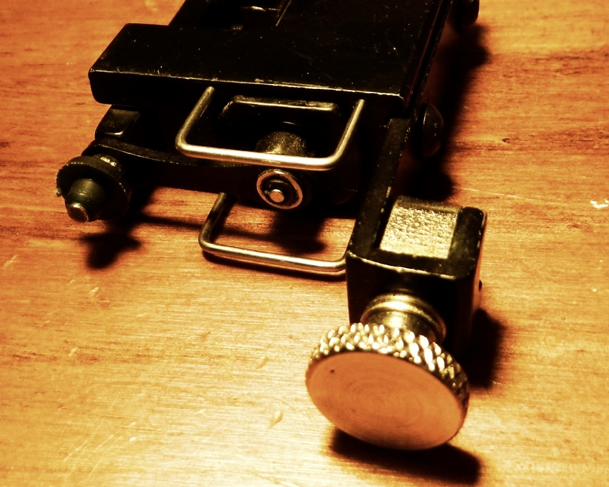
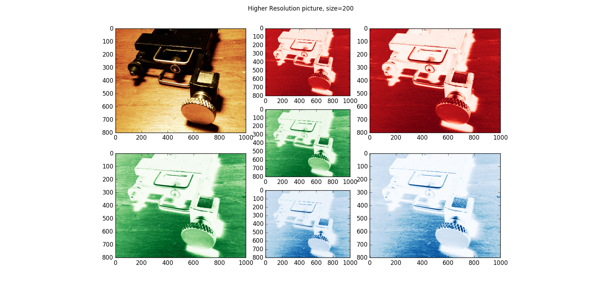

UECM3033 Assignment #2 Report
========================================================

- Prepared by: **see boon chai**
- Tutorial Group: T3

--------------------------------------------------------

## Task 1 --  $LU$ Factorization or SOR method

The reports, codes and supporting documents are to be uploaded to Github at: 

[https://github.com/seeboonchai/UECM3033_assign1](https://github.com/seeboobchai/UECM3033_assign1)

Explain your selection criteria here.

If the matrix have all positive eigenvalues and it is symmetric,after perform calculation,we will found that iteration of SOR method will be converges, so  SOR method  will be chooses to solve linear system because SOR method require less computational cost compare to LU decomposition. Otherwise the matrix will solve by  using LU decomposition.

Explain how you implement your `task1.py` here.

For task 1, inside the lu method first i try define the range and set some property  for matrix A and b in order to perform lu factorisation so that can get accurate result for b.Next, for sor method i define L,u,d which is lower,upper  triangular matrices and diagonal matrix, besides i define also a sparse matrix for substitution purpose to get omega value, with this omega value then we can get the actual formula for sor method for computation of linear system.inside solve method i try set a logical statement to make sure can get convergence result but based on criteria of sor and lu method.After run the code,i found that lu method get convergence as expected.
---------------------------------------------------------

## Task 2 -- SVD method and image compression

Put here your picture file (camera.tiff)

How many non zero element in $\Sigma$?
There are 800 non zero element in $Sigma$

Put here your lower and better resolution pictures. Explain how you generate
these pictures from `task2.py`.

 From beginning, i created a  singular value decomposition function which also known as svd function.Next,i read the image which is then compressed by keeping the first 30 non zero elements as $\Sigma$ and then  i set other non zero elements to zero,all this is first for red matrix. After that i repeat the same process by using green and blue matrix.From this task, i put in n=30 for lower resolution and n=200 for better resolution.

What is a sparse matrix?

In numerical analysis, a sparse matrix is a matrix in which most of the elements are zero
-----------------------------------

last modified: change your date here
